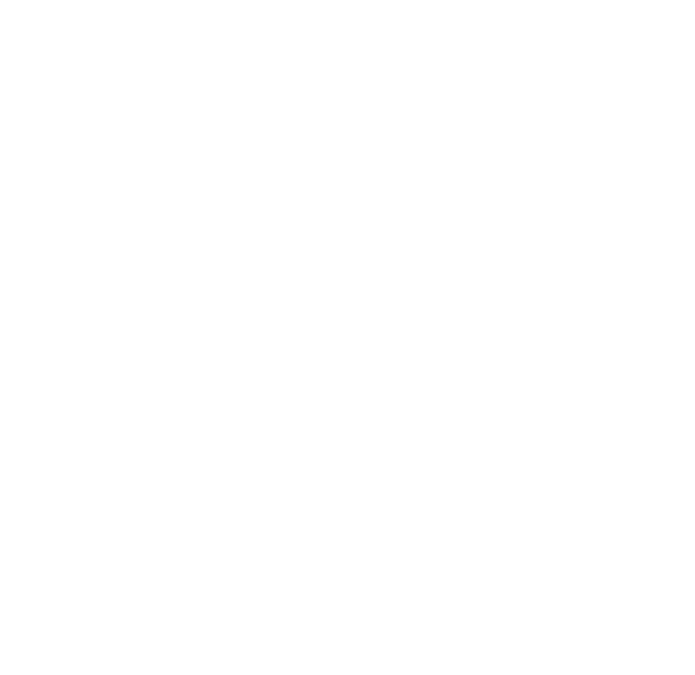

  

# C242-PR580 Team

## 📌 About Us
We are part of **Bangkit 2024 Batch 2**, a program focused on developing **Software-as-a-Service** solutions in Indonesia. Our team is committed to learning and honing skills in technology that align with industry needs.

## ✉️ Contact
For more information, feel free to reach out via email at profile, Thank You.

## 👥 Team Members

Our team consists of talented individuals working across Machine Learning, Cloud Computing, and Mobile Development.

| Student ID   | Name                                      | Email                               | Learning Path      | University                        |
|--------------|-------------------------------------------|-------------------------------------|--------------------|-----------------------------------|
| M183B4KY3428 | Nurdiansyah Krisna Putra                  | M463B4KY1662@bangkit.academy        | Machine Learning   | Universitas Amikom Yogyakarta           |
| M183B4KY1936 | Ilham Cahyo Saputro Wibowo                | M183B4KY1936@bangkit.academy        | Machine Learning   | Universitas Amikom Yogyakarta           |
| M183B4KY3076 | Muhammad Rosyid Hassan                    | M183B4KY3076@bangkit.academy        | Machine Learning   | Universitas Amikom Yogyakarta           |
| A172B4KY2048 | Jecksen Santoko                           | A172B4KY2048@bangkit.academy        | Mobile Development | Universitas Mikroskil                   |
| C504B4KY2286 | Louis Michael                             | C504B4KY2286@bangkit.academy        | Cloud Computing    | Institut Sains dan Bisnis Atma Luhur    |
| C247B4KX3150 | Mulia Rahmah                              | C247B4KX3150@bangkit.academy        | Cloud Computing    | Universitas Lambung Mangkurat           |
| C247B4KY2761 | Muhammad Baharuddin Yusuf                 | C247B4KY2761@bangkit.academy        | Cloud Computing    | Universitas Lambung Mangkurat           |

## Contributors

### Machine Learning Member
Cloud Computing member is responsible for the development of the API service and deployment of the model. In sort, in this project Cloud Computing is responsible for Backend, Infrastructure, and DevOps.

- Nurdiansyah Krisna Putra
- Ilham Cahyo Saputro Wibowo
- Muhammad Rosyid Hassan
#### Individuals

 
  
   

### Mobile Development Member
Mobile Development team responsibility is to Create an Android application, Collecting data from API supplied by Cloud Computing team, and implement the feature from Machine Learning and data to make sure the application run smoothly.

- Jecksen Santoko
#### Individuals

  

### Cloud Computing Member
Cloud Computing member is responsible for the development of the API service and deployment of the model. In sort, in this project Cloud Computing is responsible for Backend, Infrastructure, and DevOps.

- Louis Michael
- Muhammad Baharuddin Yusuf
- Mulia Rahmah
#### Individuals

 
  
   

